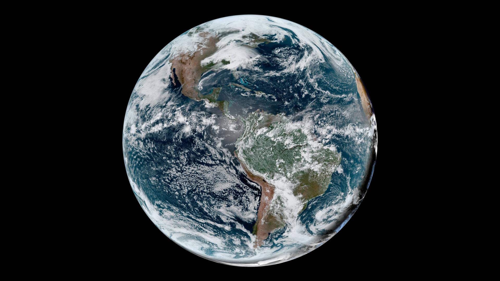

# Downlinx

Downlinx puts live images of Earth from real weather satellites on your desktop!

Downlinx is a shameless ripoff of Anthony Colangelo's [Downlink](https://downlinkapp.com/),
but Downlinx has an API rather than a GUI, and it runs on Linux.
Imitation is the sincerest form of flattery.

Downlinx provides a versatile API for downloading, resizing, cropping, and arranging images however you like.
You can also combine the live downloaded images with static images from your filesystem
(for example, if you only want the Earth on one of your several monitors).

Downlinx provides example configuration files for systemd to help you run it at login and every 20 minutes,
keeping your live Earth view up to date.

## Dependencies

- Python 3.6 or newer
- ImageMagick
- curl
- Depending on your DE or WM:
  - xloadimage
  - gconftool-2
  - gsettings
  - xfconf-query
- Optional:
  - eog

## Configuration

Downlinx organizes its work into image processing *pipelines*.
You will typically need to configure only one pipeline to render your desktop background,
but if you come up with other creative uses for Downlinx you can have as many pipelines as you want.

On your filesystem, a pipeline consists of a directory containing a python script called `run.py`.
Downlinx will automatically create a subdirectory called `images` which will store the images it works on.
Several example pipelines are included in the `pipelines` directory.

You can run Downlinx on the command line like this:

    $ ./downlinx.py pipelines/simple

This will execute `run.py` once, the idea being that it will acquire the source images,
compose them into a desktop background image, and update the background in your desktop environment.

You can use a systemd timer (or cron or any other method of your choice) to invoke Downlinx on a schedule
(once every 20 minutes is reasonable). Example configuration files for systemd are provided, and their use
is explained below.

### run.py

The size, shape, and composition of your desktop background is specified by `run.py`.
You can find an API reference below, but here's a simple example
(which you can also find in the `pipelines/simple` directory).
You can also find other examples in the `pipelines` directory.

First we initialize a Downlinx pipeline.
The `Downlinx` constructor takes the pipeline directory as an argument.
You can hard code this, or you can use `os.path.dirname(os.path.realpath(__file__))`
to directly find the directory containing `run.py`.

    import os
    from downlinx import *
    
    pipeline = Downlinx(os.path.dirname(os.path.realpath(__file__)))

Let's get a live picture of the Earth from the GOES-East satellite!
    
    earth = pipeline.clean_goes_east_large()

The picture will be quite large, probably larger than your monitor.
Let's scale it down so it fits.
Downlinx doesn't know how big your monitor is, so you'll have to tell it.
Suppose you have just one and it's 1920x1080.
We'll also scale it down a further ten percent to leave room for task bars and such on the top and bottom.
    
    monitor_size = Size(1920, 1080)
    exact_fit_size = scale_to_fit(earth.size, monitor_size)
    comfortable_fit_size = scale_factor(exact_fit_size, 0.9)
    earth_scaled = pipeline.resize(earth, comfortable_fit_size)

Now the Earth will fit on your monitor, but it's the wrong shape.
Let's place it on a black background that will exactly fit your monitor.
    
    position_of_earth_on_monitor = centering_offset(earth_scaled.size, monitor_size)
    black_background = pipeline.blank('black', monitor_size)
    final_background = pipeline.place(earth_scaled, position_of_earth_on_monitor, black_background)

Finally we can update your desktop background!
The function to do this depends on your Desktop Environment.
See the API reference below for some choices.
If you're using GNOME 3 or Unity (Ubuntu's default), this should work (in theory, I haven't tested it).

    set_background_gnome3(final_background)

### Running the pipeline automatically with systemd

In order to keep your background refreshed with live images from space, you'll need to run Downlinx on a schedule.
You can use cron or any other method you like, but I prefer systemd.
You can see example configuration files in the `systemd` directory.
Copy these files to `~/.config/systemd/user`.
You'll need to customize the paths on the `ExecStart` line in `downlinx.service`
to point to your copy of downlinx and the pipeline you wish to use.

After making any changes to your systemd user units, you'll need to reload them:

    $ systemctl --user daemon-reload

To run Downlinx once, to test it, try this:

    $ systemctl --user start downlinx

To see the status of the Downlinx unit:

    $ systemctl --user status downlinx

If something went wrong, check the logs:

    $ journalctl --user -xe

To start the timer so that Downlinx will run regularly:

    $ systemctl --user enable --now downlinx.timer

You can see the status of your timers like this:

    $ systemctl --user list-timers --all

## API reference

### Image acquisition and processing

    class Image(object):
        def __init__(self, filepath: str) -> None:
            self.filepath
            self.size

An `Image` stores the size of an image (in pixels) and its location in the filesystem.
The size is determined automatically, so you only need to specify the path when constructing one.
    
    class Pipeline(object):
        def __init__(self, pipeline_dir: str) -> None:

An image processing `Pipeline` that lets you operate on a series of related images.
`pipeline_dir` contains the `run.py` file and a subdirectory will be created to store images.

        def blank(self, color: str, size: Size) -> Image:

Make a new blank image of the specified color (described using a string) and `Size`.

        def crop(self, image: Image, offset: Pos, size: Size) -> Image:

Crop an image down to a region specified by `offset` (a `Pos`) and `size` (a `Size`).

        def place(self, new: Image, offset: Pos, base: Image) -> Image:

Place a `new` image on top of a `base` image at a particular `offset`.

        def resize(self, image: Image, size: Size) -> Image:

Resize an image to the specified `Size`.

        def to_jpg(self, image: Image) -> Image:

Make a `.jpg` image. Most functions return `.png` for lossless composition,
but `set_background_wm_only()` needs a `.jpg` to render colors accurately,
so this lets you do that final conversion step.
    
    class Downlinx(Pipeline):
        def __init__(self, pipeline_dir: str) -> None:

Subclass of `Pipeline` that provides specialized functions for interacting with satellite images.

        def get(self, source_name: str, size: str) -> Image:

Download a live image from an actual weather satellite!
The URL to download is looked up in `sources.json` by the `'name'` and `'url'` keys.
`size` should be one of `'tiny'`, `'small'`, `'large'`, `'full'`.
`'large'` is a typically a good compromise between resolution and download size.

Each source has a minimum refresh interval. This function checks to see if the file has already
been downloaded, and only downloads again if the modification date is older than the
minimum refresh interval.

`sources.json` originally came from [https://downlinkapp.com/sources.json](https://downlinkapp.com/sources.json),
but I stored it here just in case something happens to the original.
Also I changed the Himawari-8 URLs to use https because I got a redirect page when I tried the originals.

        def clean_goes_east_large(self) -> Image:
        def clean_goes_west_large(self) -> Image:
        def clean_himawari8_large(self) -> Image:

Images directly from most sources include logos, information bars, or other less than beautiful elements.
These functions return nice clean images of the entire Earth from different satellites.

### Geometry

    class Pos(typing.NamedTuple):
        x: int
        y: int

Represents a position in an image, measured in pixels.
(0, 0) is top-left, positive x goes right, positive y goes down.

    class Size(typing.NamedTuple):
        w: int
        h: int

Represents the size of an image or region, measured in pixels.

    def scale_to_width(orig: Size, width: int) -> Size:

Scale a `Size` to a new `width`, preserving the aspect ratio.

    def scale_to_height(orig, height):

Scale a `Size` to a new `height`, preserving the aspect ratio.

    def scale_to_height(orig: Size, height: int) -> Size:

Scale a `Size` so it will fit completely inside another `Size`, preserving the aspect ratio.

    def add_pos(pos1: Pos, pos2: Pos) -> Pos:

Vector addition on `Pos` objects (`Pos(pos1.x+pos2.x, pos1.y+pos2.y)`).

    def aspect_ratio(size: Size) -> float:

Return the aspect ratio of a `Size` as a float (`w/h`).

    def centering_offset(image_size: Size, frame_size: Size, frame_offset: Pos = Pos(0, 0)) -> Pos:

Return an offset which, if passed to `Pipeline.place()`,
will center an image of the given size in a frame of the given size and position.
This can also be used to center a crop region of a particular size in an image by
using the image size as `frame_size` and the crop region size as `image_size`.

### Setting the background image

Set an image as the desktop background.

    def set_background_wm_only(image: Image) -> None:

Use this if you're using a Window Manager (like XMonad or Openbox) but no Desktop Environment.
It draws the image directly on the X root. Use a `.jpg`, not a `.png`, to get accurate color rendering.
See `Pipeline.to_jpg()` to do this conversion.

    def set_background_gnome2(image: Image) -> None:

Use this if you're using GNOME 2. Note that it hasn't been tested - good luck!

    def set_background_gnome3(image: Image) -> None:

Use this if you're using GNOME 3 or Unity. Note that it hasn't been tested - good luck!

    def set_background_xfce(monitor: str, image: Image) -> None:

Use this if you're using Xfce.
It only operates on one monitor at a time, specified by a string such as `'screen0/monitor0'`,
so you'll need to compose several backgrounds if you have multiple monitors, or crop a single image into several pieces.
Supposedly, valid monitor identifiers can be listed with `xfconf-query --channel xfce4-desktop --list`.
Note that it hasn't been tested - good luck!

### Debugging

    def eog(image: Image) -> None:

Open an image in the `eog` (Eye of GNOME) image viewer. This is useful for debugging your image processing pipeline.
This function will block until you close `eog`.
